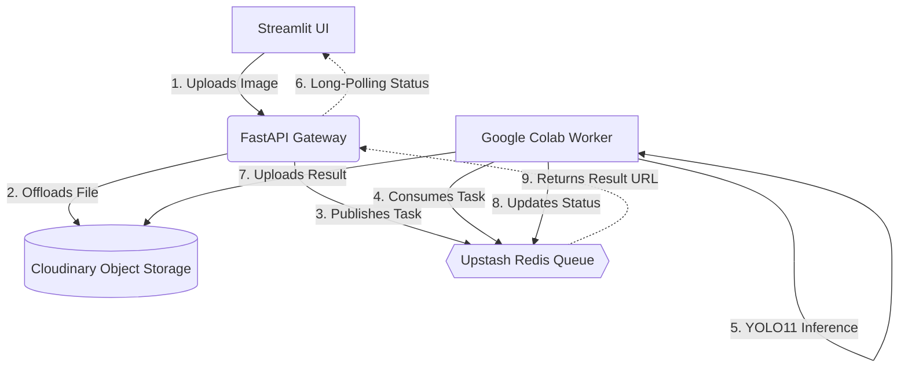

# Distributed AI Vision Pipeline: YOLO11

A fully decoupled, cloud-native computer vision pipeline demonstrating enterprise-grade architectural patterns. This project processes real-time object detection using YOLO11, leveraging a distributed microservices architecture to offload heavy GPU computation from the main web server.

## System Architecture

Unlike standard monolithic AI applications that block the main thread during inference, this system utilizes an asynchronous, message-driven architecture.


## 🛠️ Tech Stack

* **Frontend:** Streamlit (Hosted on Streamlit Community Cloud)
* **API Gateway:** FastAPI & Uvicorn (Hosted on Render)
* **Message Broker:** Upstash Redis (Serverless Cloud Queue)
* **Task Queue:** Celery (Distributed Task Execution)
* **Remote Worker:** Google Colab (Nvidia T4 GPU)
* **Object Storage:** Cloudinary
* **AI Model:** Ultralytics YOLO11n

---

## 💡 Why This Architecture?

* **Decoupling:** The frontend (`Streamlit`) and the heavy AI computation (`YOLO11`) are completely separated. If the GPU crashes, the web server stays alive.
* **Scalability:** By utilizing `Redis` and `Celery`, we can easily scale the system. If traffic spikes, we simply spin up more Celery workers to consume from the same Redis queue.
* **Stateless Gateway:** The `FastAPI` server does not store images locally. It immediately offloads them to `Cloudinary` and passes a lightweight URL string through the queue, drastically reducing memory consumption.
* **Asynchronous UX:** The frontend uses a non-blocking polling mechanism, ensuring the user interface remains responsive while the remote GPU processes the image.

---

##  Live Demo Setup

Because the remote worker utilizes an on-demand Google Colab GPU to optimize cloud costs, the inference engine must be manually initialized.

1. **Initialize the Worker:** Open the `colab_worker.ipynb` notebook in Google Colab, connect to a T4 GPU, and execute the Celery worker cell.
2. **Access the UI:** Navigate to the live Streamlit frontend.
3. **Process:** Upload an image. The FastAPI gateway will route the task to Redis, where the active Colab GPU will consume it, process the bounding boxes, and return the annotated image.

---

## 💻 Local Development

To run this pipeline locally for development:

1. **Clone the repository:**
   ```bash
   git clone [https://github.com/your-username/distributed-ai-pipeline-yolo11.git](https://github.com/your-username/distributed-ai-pipeline-yolo11.git)
   cd distributed-ai-pipeline-yolo11

2. **Create a virtual environment and install dependencies:**
   ```bash
   python -m venv venv
   source venv/bin/activate  # On Windows use `venv\Scripts\activate`
   pip install -r requirements.txt
   ```
3. **Configure Environment Variables:**
   Create a .env file in the root directory and add your cloud credentials:
   ```bash
   CLOUDINARY_CLOUD_NAME=your_value
   CLOUDINARY_API_KEY=your_value
   CLOUDINARY_API_SECRET=your_value
   REDIS_URL=rediss://your_upstash_url:port?ssl_cert_reqs=CERT_NONE
4. **Start the FastAPI Gateway:**
   ```bash
   uvicorn main:app --reload
5. **Start the Streamlit Frontend (in a new terminal):**
   ```bash
   streamlit run app.py


